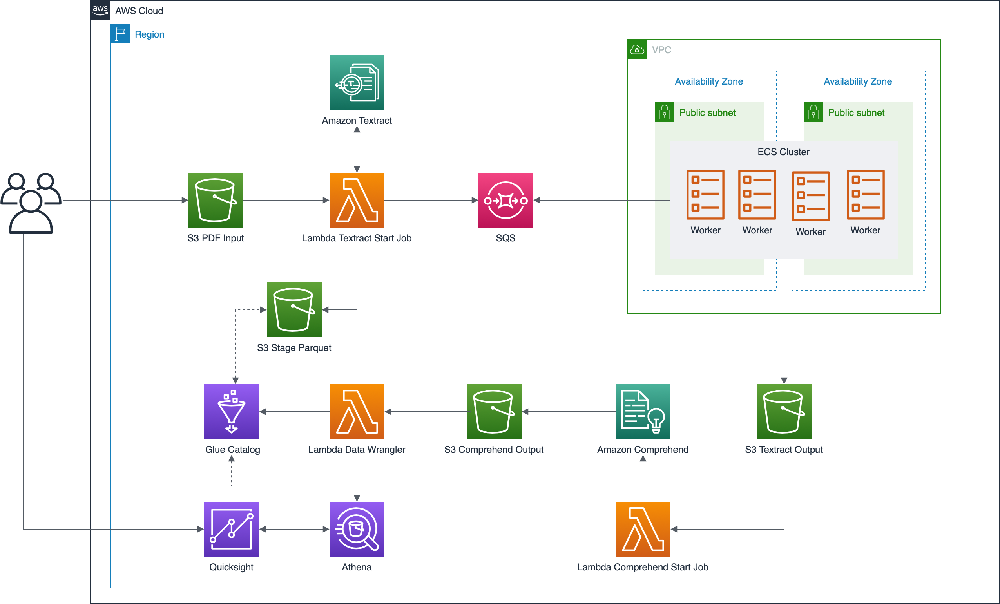

# nlp-analysis-demo

The purpose of this demo is to build a stack that uses Amazon Comprehend and Amazon Textract to analyze unstructured data and generate insights and trendsn from it.

# Overview

In this demonstration we are going to build a stack to extract text from a PDF document that will be uploaded in Amazon S3, run comprehend against the text to generate aggregate and generate insights using **start_entities_detection_job** API call.

**This demo was tested in us-east-1 and with pt language code**

## Prerequisites

- [Docker](https://docs.docker.com/get-docker/)
- [awscli](https://docs.aws.amazon.com/cli/latest/userguide/cli-chap-install.html)
- [Pre configured AWS credentials](https://docs.aws.amazon.com/amazonswf/latest/awsrbflowguide/set-up-creds.html)
- [Pre configured VPC with minimun of 2 public subnets]()


# Architecture Diagram

<p align="center"> 

</p>


# Setup instructions

First of all we need to setup the foundation for our solution, that consists of create the bucket to store our lambda code and the ECR to store our worker docker image.

A script was developed to help in that task, simple run:

```bash
./setup.sh
```

The output will be the follow:

```yaml
Starting environment setup...


Creating ECR Repository...
Created ECR Repository: xxxxx.dkr.ecr.us-east-1.amazonaws.com/ai-comprehend-ml

Creating S3 Bucket...
Created S3 Bucket: lambdacode-sadasd

File zipped: lambda_comprehend.zip
File zipped: lambda_textract.zip
File zipped: lambda_data_wrangler.zip

Building docker image and pushing to ecr...

Uploading all required files to S3...

"Information that will be used in CloudFormation:":
BucketLambdaCode: lambdacode-sadasd
ImageUrl: xxxx.dkr.ecr.us-east-1.amazonaws.com/ai-comprehend-ml:latest
```

We are going to use the **BucketLambdaCode** and **ImageUrl** values later on the demonstration.

## CloudFormation

In this repository we have two CloudFormation Templates that we are going to use to provision the stack.

### Serveless Stack Template:

```bash
aws cloudformation create-stack --stack-name serverless-npl-stack --template-body file://cloudformation/serverless-stack.yaml --parameters ParameterKey=BucketName,ParameterValue=<BUCKET_NAME> ParameterKey=BucketLambdaCode,ParameterValue=<BUCKET_LAMBDA_CODE> ParameterKey=LanguageCode,ParameterValue=pt --capabilities CAPABILITY_IAM
```

**Values to be replaced:**

**<BUCKET_NAME>** - Bucket name that will be created.

**<BUCKET_LAMBDA_CODE>** - Bucket name that was created in the script **setup.sh** (BucketLambdaCode).

### ECS Worker Stack Template:

```bash
aws cloudformation create-stack --stack-name ecs-npl-stack --template-body file://cloudformation/ecs-stack.yaml --parameters ParameterKey=ClusterName,ParameterValue=ecs-cluster-demo ParameterKey=ServiceName,ParameterValue=textract-worker ParameterKey=ImageUrl,ParameterValue=<IMAGE_URL> ParameterKey=BucketName,ParameterValue=<BUCKET_NAME> ParameterKey=QueueName,ParameterValue=sqs_textract_messages ParameterKey=VpcId,ParameterValue=<VPC_ID> ParameterKey=VpcCidr,ParameterValue=<VPC_CIDR> ParameterKey=PubSubnet1Id,ParameterValue=<PUB_SUBNET_1_ID> ParameterKey=PubSubnet2Id,ParameterValue=<PUB_SUBNET_2_ID> --capabilities CAPABILITY_IAM
```

**Values to be replaced:**

**<IMAGE_URL>** - The URI of ECR the image uploaded in the script **setup.sh** (ImageUrl).

**<BUCKET_NAME>** - The same of above.

**<VPC_ID>** - VPC that we will use to provision ECS cluster.

**<VPC_CIDR>** - VPC CIDR that we will use to provision ECS cluster.

**<PUB_SUBNET_1_ID>** - First public Subnet ID that we will use to provision ECS cluster.

**<PUB_SUBNET_2_ID>** - Second public Subnet ID that we will use to provision ECS cluster.

# Testing the solution

Now we need to upload a PDF file to our **S3 bucket** in a specific path (textract/input/) to trigger the workflow.

```bash
aws s3 cp <MY_PDF_FILE> s3://<BUCKET_NAME>/textract/input/
```

This will be the result in the S3 console.

<p align="center"> 

</p>

After that all the components of the architecture will be triggered, the result of that will be a Database created by AWS Glue that we can use AWS Athena to query the information agreggated by our solution with Amazon Comprehend.

Access the Athena console and select the Database **npl_textract_comprehend**

<p align="center"> 

</p>

Click on the table and select **Preview Table**

<p align="center"> 

</p>

The result will be the aggregation of the entities founded by Amazon Comprehend (Using the default entities), [Check default Comprehend entities](https://docs.aws.amazon.com/comprehend/latest/dg/how-entities.html)

## Quicksight (Optional)

Also you can use Amazon Quicksight to create amazing dashboard plugged in Athena.

- [Quicksight Getting Started](https://docs.aws.amazon.com/quicksight/latest/user/getting-started.html)
- [Creating Dataset using Athena](https://docs.aws.amazon.com/quicksight/latest/user/create-a-data-set-athena.html)

After all the setup the dashboard that you can create may look like this:

<p align="center"> 

</p>

# Cleaning up:

- Delete all the files inside of the provisioned S3 bucket.

```shell
aws s3 rm s3://<BUCKET_NAME> --recursive
```

- Delete the container image, inside the ECR Repository.

- Delete the CloudFormation stacks.

```shell
aws cloudformation delete-stack --stack-name serverless-npl-stack
```

```shell
aws cloudformation delete-stack --stack-name ecs-npl-stack
```

- Delete the S3 bucket that we used to store the lambda codes and lambda layer.

```shell
aws s3 rb s3://<BUCKET_LAMBDA_CODE> --force
```

## Security

See [CONTRIBUTING](CONTRIBUTING.md#security-issue-notifications) for more information.

## License

This library is licensed under the MIT-0 License. See the LICENSE file.

